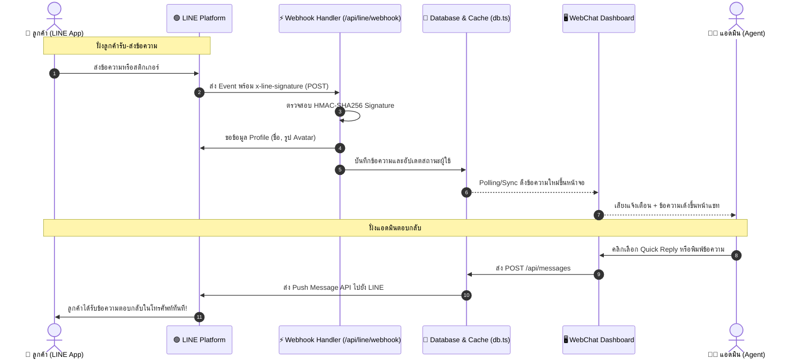

# 💬 ROBO LINGO WebChat - LINE Official Account Live Chat System

<div align="center">


**ระบบไลฟ์แชทสองทาง (Two-Way Live Chat Helpdesk) เชื่อมต่อ LINE Official Account (LINE OA) แบบ Real-time**  
พัฒนาด้วย **Next.js 15 (App Router)**, **TypeScript**, **LINE Messaging API** และ **Clean Architecture**

[🚀 ทดลองแอดไลน์ OA](#-ข้อมูลสำหรับการทดสอบ-submission-deliverables) • [✨ ฟีเจอร์เด่น](#-ฟีเจอร์เด่น-key-features) • [🏛️ สถาปัตยกรรมระบบ](#️-สถาปัตยกรรมระบบ-system-architecture) • [🧪 การทดสอบ](#-การทดสอบและความเสถียร-testing--quality) • [📦 การติดตั้ง](#-วิธีการติดตั้งและรันในเครื่อง-local-setup)

</div>

---

## 📌 บทนำและภาพรวมโครงการ (Project Overview)

**ROBO LINGO WebChat** คือระบบบริหารจัดการข้อความลูกค้าและศูนย์บริการลูกค้า (Customer Support Helpdesk) ที่เชื่อมต่อโดยตรงกับ **LINE Official Account (LINE OA)** ผ่าน **LINE Messaging API** 

ระบบถูกออกแบบมาเพื่อแก้ปัญหาของทีมแอดมินที่ต้องตอบลูกค้าจำนวนมาก โดยมอบประสบการณ์การทำงานที่ **รวดเร็ว ไหลลื่น ไม่มีหน่วง (Zero-Latency UX)** ด้วยเทคโนโลยี **Offline-First Caching**, ดีไซน์ **Emerald Glassmorphism** ระดับพรีเมียม และระบบเทมเพลตคำตอบด่วนที่ปรับแต่งได้อิสระ

---

## ✨ ฟีเจอร์เด่น (Key Features)

### 1. ⚡ การรับ-ส่งข้อความสองทางแบบเรียลไทม์ (Two-Way Live Messaging)
- **Webhook Integration**: รับข้อความและอีเวนต์จาก LINE Platform ทันทีที่ลูกค้าส่ง (รองรับทั้ง Text Message และ Sticker)
- **Push Message API**: แอดมินสามารถพิมพ์ตอบกลับจากหน้าเว็บ ข้อความจะถูกส่งตรงเข้าแอป LINE ของลูกค้าในทันที
- **Sound Alert & Notification**: เสียงแจ้งเตือนนุ่มนวลแบบ Glassmorphism เมื่อมีข้อความใหม่เข้ามา

### 2. 🛡️ ความปลอดภัยมาตรฐานระดับ Enterprise (Security & Signature Verification)
- ตรวจสอบความถูกต้องของ Webhook ทุก Request ด้วย **HMAC-SHA256 Signature Verification** (`x-line-signature`) เพื่อป้องกัน Request ปลอมแปลง
- ป้องกัน Timing Attack ด้วย `crypto.timingSafeEqual`

### 3. 👥 การจัดการลูกค้าอัจฉริยะ (Intelligent Customer Management)
- **Auto-Enrich Profile**: ดึงชื่อแสดงผล (Display Name), รูปโปรไฟล์ (Avatar) และสถานะจาก LINE Profile API โดยอัตโนมัติ
- **Unread Badges & Monotonic Order**: มีตัวนับข้อความที่ยังไม่ได้อ่าน พร้อมระบบเรียงลำดับแชทตามเวลาล่าสุด โดยป้องกันปัญหาข้อมูลเก่าทับข้อมูลใหม่อย่างแม่นยำ
- **Search & Filter**: ค้นหาลูกค้าตามชื่อหรือข้อความล่าสุดได้ทันที

### 4. ⚡ จัดการเทมเพลตคำตอบด่วนได้เอง (Customizable Quick Replies)
- **คลิกเดียวส่งทันที**: มีชิปคำตอบด่วนด้านบนกล่องข้อความ คลิกส่งหาลูกค้าได้ในเสี้ยววินาที
- **Modal จัดการเทมเพลต**: แอดมินสามารถ **เพิ่มข้อความใหม่ (Add)**, **แก้ไขแบบ Inline (Edit)** และ **ลบ (Delete)** ข้อความที่ใช้บ่อยได้เอง
- **Reset to Defaults**: ปุ่มกู้คืน 4 ข้อความมาตรฐานของระบบได้ตลอดเวลา
- **ระบบจัดเก็บ 2 ชั้น (Offline-First)**: โหลดเร็วทันทีผ่าน Local Storage และ Sync กับเซิร์ฟเวอร์แบบ Background

### 5. 🗑️ จัดการบทสนทนาอย่างปลอดภัย (Safe Conversation Management)
- **ลบห้องแชท (Delete Chat)**: ลบผู้ใช้ออกจากระบบพร้อมข้อความทั้งหมด
- **ล้างประวัติข้อความ (Clear History)**: ล้างข้อความเก่าโดยยังคงเก็บโปรไฟล์ลูกค้าไว้
- มี Modal แจ้งเตือนยืนยันก่อนลบ ป้องกันการกดผิดพลาดโดยไม่ตั้งใจ

### 6. 🎨 ดีไซน์ระดับพรีเมียม (Emerald Glassmorphism Dark Theme)
- โทนสีมืดทันสมัย (Dark Surface) ผสานสีเขียว LINE Emerald
- เลย์เอาต์ Helpdesk 3 คอลัมน์ (Inbox Sidebar, Chat Canvas, Customer Intelligence Drawer)
- รองรับ Responsive Design ทุกขนาดหน้าจอ ทั้ง Desktop, Tablet และ Mobile

---

## 🏛️ สถาปัตยกรรมระบบ (System Architecture)

ระบบแบ่งแยกหน้าที่การทำงานอย่างชัดเจนตามหลัก **Clean Architecture** และ **Separation of Concerns**:

```
src/
├── app/                      # Presentation & Route Handlers Layer
│   ├── api/
│   │   ├── line/webhook/     # LINE Webhook (HMAC-SHA256 & Event Parsing)
│   │   ├── messages/         # GET, POST (Push Message), DELETE (Clear msgs)
│   │   ├── users/            # GET (Profile enrichment), DELETE (Delete user)
│   │   ├── users/read/       # POST (Mark conversation as read)
│   │   └── quick-replies/    # GET, POST (Manage quick reply templates)
│   ├── layout.tsx            # Root Layout & Metadata
│   └── page.tsx              # Main Helpdesk Container
├── components/               # Pure UI Components Layer
│   ├── ChatSidebar.tsx       # รายการผู้ใช้, ค้นหา, Unread Count
│   ├── ChatCanvas.tsx        # กล่องสนทนา, Quick Reply Chips, ช่องพิมพ์
│   ├── CustomerDrawer.tsx    # ข้อมูลลูกค้า, สถิติ, ปุ่มล้าง/ลบแชท
│   ├── QuickRepliesModal.tsx # หน้าต่างเพิ่ม/แก้ไข/ลบเทมเพลตคำตอบด่วน
│   ├── DeleteModal.tsx       # กล่องยืนยันการลบแชท
│   └── LineQrModal.tsx       # QR Code เพิ่มเพื่อน LINE OA
├── hooks/                    # Custom Hooks & State Logic Layer
│   ├── useWebChat.ts         # รวม Business Logic, Polling, User & Messages State
│   └── useQuickReplies.ts    # Logic จัดการและ Sync เทมเพลตคำตอบด่วน
├── services/                 # Frontend API Abstraction Layer
│   ├── chatService.ts        # เรียก API ข้อความ
│   ├── userService.ts        # เรียก API ผู้ใช้
│   └── quickReplyService.ts  # เรียก API Quick Replies
└── lib/                      # Core Utilities & Persistence Layer
    ├── types.ts              # TypeScript Interfaces & Data Contracts
    ├── db.ts                 # Database Engine & Local JSON Persistence
    ├── storage.ts            # Client-Side Caching & LocalStorage
    └── line.ts               # LINE SDK Utilities (Signature, Profile, Push)
```

### 🔄 Data Flow Sequence Diagram



---

## 🧪 การทดสอบและความเสถียร (Testing & Quality)

โปรเจกต์มีชุดทดสอบอัตโนมัติครบทุกเลเยอร์ด้วย **Vitest** ผ่านการทดสอบทั้งหมด **53/53 Tests**:

```bash
$ npm test

 ✓ src/lib/__tests__/line.test.ts (10 tests)       # Signature verification & Profile fetching
 ✓ src/lib/__tests__/storage.test.ts (8 tests)     # Client caching & zero-latency sync
 ✓ src/lib/__tests__/db.test.ts (11 tests)         # JSON database operations & safety
 ✓ src/services/__tests__/services.test.ts (8 tests) # Service layer HTTP handling
 ✓ src/app/api/__tests__/routes.test.ts (16 tests) # Next.js Route Handlers & Webhooks

 Test Files  5 passed (5)
      Tests  53 passed (53)
```

- **Production Build Verification**: ผ่านการ build ด้วย `npm run build` ไร้ Type Error หรือ Warning

---

## 📦 วิธีการติดตั้งและรันในเครื่อง (Local Setup)

### 1. โคลน Repository และติดตั้ง Dependencies

```bash
git clone https://github.com/Kittipattt/ROBOLINGO-webchat.git
cd ROBOLINGO-webchat
npm install
```

### 2. กำหนดค่า Environment Variables

สร้างไฟล์ `.env.local` ที่ Root Directory แล้วระบุคีย์ LINE OA:

```env
LINE_CHANNEL_ID=2011444753
LINE_CHANNEL_SECRET=a332359595bf165877cafd925c2f5ccf
LINE_CHANNEL_ACCESS_TOKEN=<your_line_channel_access_token>

NEXT_PUBLIC_LINE_OA_ID=@194rgooz
NEXT_PUBLIC_LINE_OA_URL=https://line.me/R/ti/p/@194rgooz
```

### 3. เริ่มต้นรันเซิร์ฟเวอร์สำหรับ Development

```bash
npm run dev
```

เปิดเบราว์เซอร์ไปที่: [http://localhost:3000](http://localhost:3000)

### 4. รันทดสอบ Unit & Integration Tests

```bash
npm test
```

---

## 🌐 การเชื่อมต่อ LINE Webhook ในเครื่อง (Local Tunneling)

เนื่องจาก LINE Messaging API ต้องการส่ง Webhook มายัง HTTPS URL สาธารณะ ให้ใช้ `ngrok`:

```bash
npx ngrok http 3000
```

นำ Forwarding URL ที่ได้ (เช่น `https://xxxx-xx.ngrok-free.app`) ไปใส่ใน **[LINE Developers Console](https://developers.line.biz/)**:
1. เข้าไปที่แท็บ **Messaging API**
2. **Webhook URL**: `https://xxxx-xx.ngrok-free.app/api/line/webhook`
3. กดปุ่ม **Verify** (ต้องขึ้นผลลัพธ์ว่า Success)
4. เปิดสวิตช์ **Use webhook** เป็น **ON**

---

## 🚀 การ Deploy บน Vercel

1. Fork หรือ Push โค้ดเข้า GitHub ของคุณ
2. นำ Repository ไป Import บน [Vercel Dashboard](https://vercel.com/)
3. ในส่วน **Environment Variables** เพิ่มค่าที่จำเป็น:
   - `LINE_CHANNEL_ID`
   - `LINE_CHANNEL_SECRET`
   - `LINE_CHANNEL_ACCESS_TOKEN`
   - `NEXT_PUBLIC_LINE_OA_ID`
   - `NEXT_PUBLIC_LINE_OA_URL`
4. กด **Deploy**
5. นำ Production Domain ที่ได้ไปตั้งค่า Webhook ใน LINE Developers Console:
   - `https://<your-vercel-domain>.vercel.app/api/line/webhook`

---

## 📱 ข้อมูลสำหรับการทดสอบ (Submission Deliverables)

| รายการ | ข้อมูล / ลิงก์ |
| :--- | :--- |
| **LINE Official Account** | [`@194rgooz`](https://line.me/R/ti/p/@194rgooz) |
| **ลิงก์แอดไลน์ทดสอบ** | [https://line.me/R/ti/p/@194rgooz](https://line.me/R/ti/p/@194rgooz) |
| **GitHub Repository** | [https://github.com/Kittipattt/ROBOLINGO-webchat](https://github.com/Kittipattt/ROBOLINGO-webchat) |
| **Pull Request (Feature Branch)** | [PR: feat/custom-quick-replies](https://github.com/Kittipattt/ROBOLINGO-webchat/pull/new/feat/custom-quick-replies) |

---

<div align="center">
  <sub>พัฒนาด้วยความใส่ใจในรายละเอียด โดย Kittipattt • Powered by Next.js & LINE Messaging API</sub>
</div>
