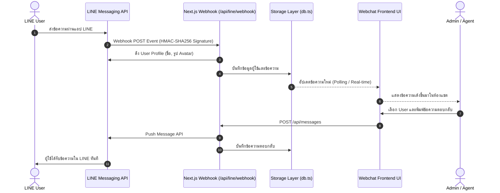

# WebChat - LINE Official Account Live Chat System

เว็บแชทสองทาง (Two-way WebChat) พัฒนาด้วย **Next.js (TypeScript)** เชื่อมต่อกับ **LINE Official Account (LINE OA)** ผ่าน LINE Messaging API รองรับการรับข้อความจากผู้ใช้ LINE เข้าสู่หน้าเว็บแบบ Real-time และให้แอดมินสามารถเลือกผู้ใช้เพื่อพิมพ์ข้อความตอบกลับไปยัง LINE ได้ทันที

---

## ฟีเจอร์หลัก (Features)

- **รับข้อความจาก LINE OA**: รองรับ Webhook Signature Verification (`x-line-signature`) เพื่อความปลอดภัย พร้อมดึง Profile ผู้ใช้ (ชื่อ, รูป Avatar) จาก LINE Platform โดยอัตโนมัติ
- **ระบุตัวตนผู้ส่ง**: แสดงรายการผู้ใช้ที่เคยติดต่อ พร้อม Avatar, ชื่อผู้ใช้, ข้อความล่าสุด, เวลา และจำนวนข้อความที่ยังไม่ได้อ่าน (Unread badge)
- **เลือก User และตอบกลับ**: คลิกเลือกผู้ใช้เพื่อดูประวัติการสนทนา และส่งข้อความตอบกลับแบบ Push Message ตรงไปยังโทรศัพท์มือถือของผู้ใช้
- **Modern Helpdesk UI**: ออกแบบด้วย Vanilla CSS สไตล์ Glassmorphism พรีเมียม รองรับ Dark Mode, Responsive Design และเสียงแจ้งเตือนเมื่อมีข้อความเข้า
- **ปุ่มช่วยทดสอบ**: มี Modal แสดง QR Code แอดไลน์ `@194rgooz` และปุ่มจำลองข้อความเข้า (Simulate Incoming Message) เพื่อการทดสอบที่สะดวกรวดเร็ว

---

## สถาปัตยกรรมระบบ (Architecture)



---

## วิธีการติดตั้งและรันในเครื่อง (Local Setup)

### 1. Clone Repository & Install Dependencies

```bash
git clone <your-repo-url>
cd WebChat
npm install
```

### 2. ตั้งค่า Environment Variables

คัดลอกไฟล์ `.env.example` เป็น `.env.local` แล้วใส่ Credential ของ LINE OA:

```env
LINE_CHANNEL_ID=2011444753
LINE_CHANNEL_SECRET=a332359595bf165877cafd925c2f5ccf
LINE_CHANNEL_ACCESS_TOKEN=<your_channel_access_token>

NEXT_PUBLIC_LINE_OA_ID=@194rgooz
NEXT_PUBLIC_LINE_OA_URL=https://line.me/R/ti/p/@194rgooz
```

### 3. รัน Development Server

```bash
npm run dev
```

เปิดเบราว์เซอร์ไปที่ [http://localhost:3000](http://localhost:3000)

---

## การเชื่อมต่อ LINE Webhook สำหรับทดสอบใน Local

เนื่องจาก LINE Messaging API ต้องการส่ง Webhook มาที่ HTTPS URL สาธารณะ ให้ใช้ `ngrok` หรือ `localtunnel`:

```bash
npx ngrok http 3000
```

นำ URL ที่ได้ไปใส่ใน **LINE Developers Console** -> แท็บ **Messaging API**:
- **Webhook URL**: `https://<your-ngrok-domain>/api/line/webhook`
- กดปุ่ม **Verify** (ต้องขึ้น Success)
- เปิดสวิตช์ **Use webhook** เป็น **ON**

---

## การ Deploy บน Vercel

1. Push โค้ดทั้งหมดขึ้น GitHub (Public Repository)
2. นำ Repository ไป Import ใน [Vercel Dashboard](https://vercel.com/)
3. ในขั้นตอน **Environment Variables** ให้ใส่ค่าจาก `.env.local` ทั้งหมด:
   - `LINE_CHANNEL_ID`
   - `LINE_CHANNEL_SECRET`
   - `LINE_CHANNEL_ACCESS_TOKEN`
   - `NEXT_PUBLIC_LINE_OA_ID`
   - `NEXT_PUBLIC_LINE_OA_URL`
4. กด **Deploy**
5. เมื่อ Deploy เสร็จ นำ Vercel Domain ไปใส่ใน **LINE Developers Console**:
   - `https://<your-vercel-domain>.vercel.app/api/line/webhook`
   - กดปุ่ม **Verify** และเปิด **Use webhook**

---

## ข้อมูลสำหรับการส่งแบบทดสอบ (Submission Deliverables)

1. **URL LINE OA ที่ใช้ทดสอบ**: https://line.me/R/ti/p/@194rgooz (LINE ID: `@194rgooz`)
2. **URL เข้าใช้งาน Webchat**: `https://<your-vercel-domain>.vercel.app`
3. **URL GitHub Repository**: `https://github.com/<your-username>/<your-repo>`
